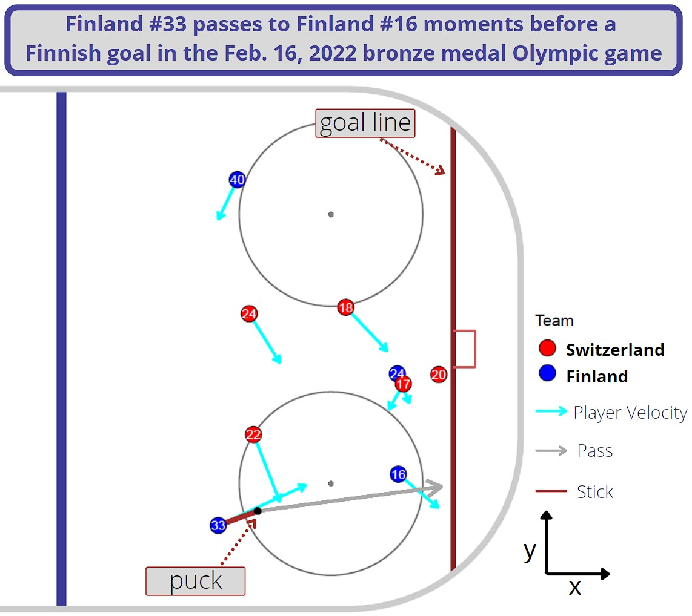
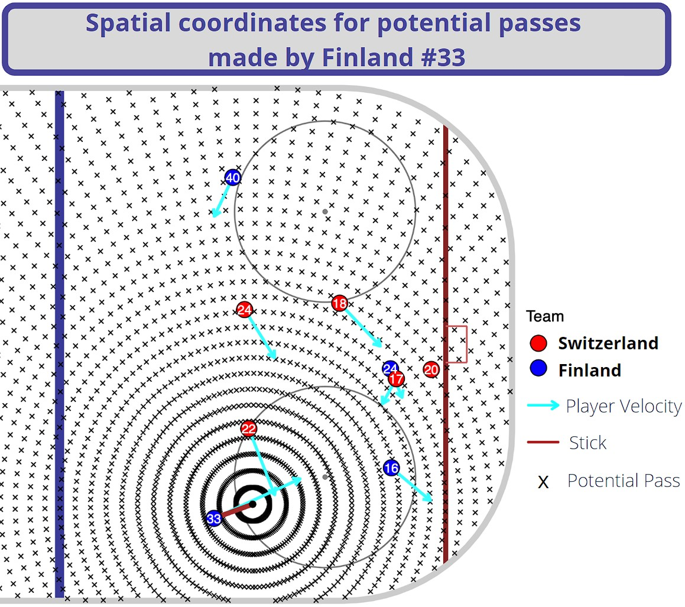
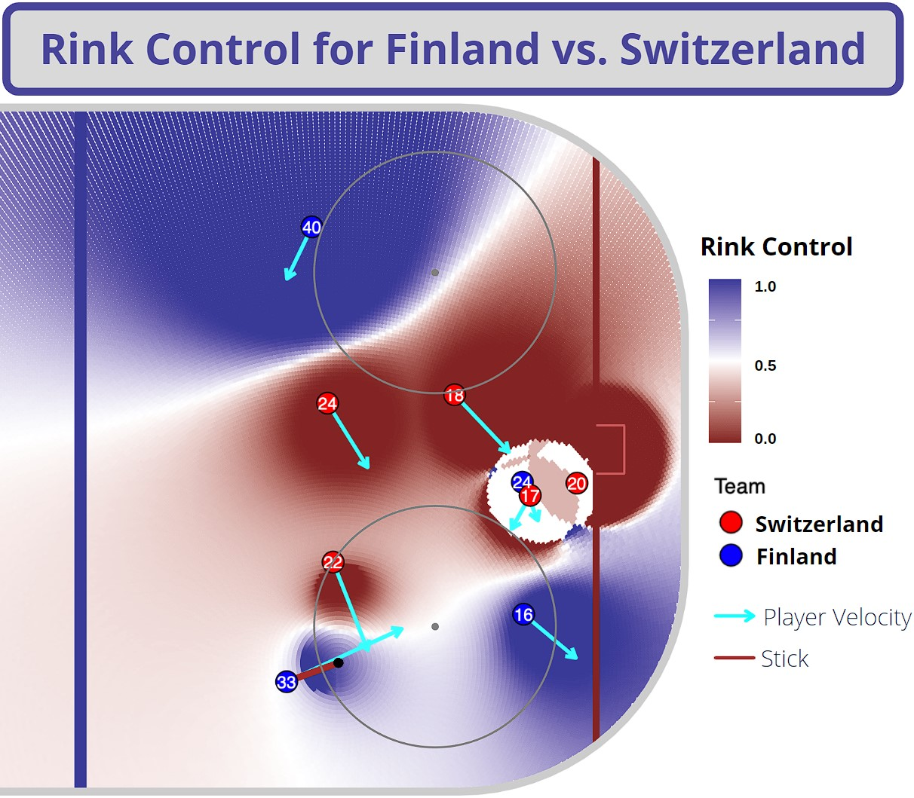
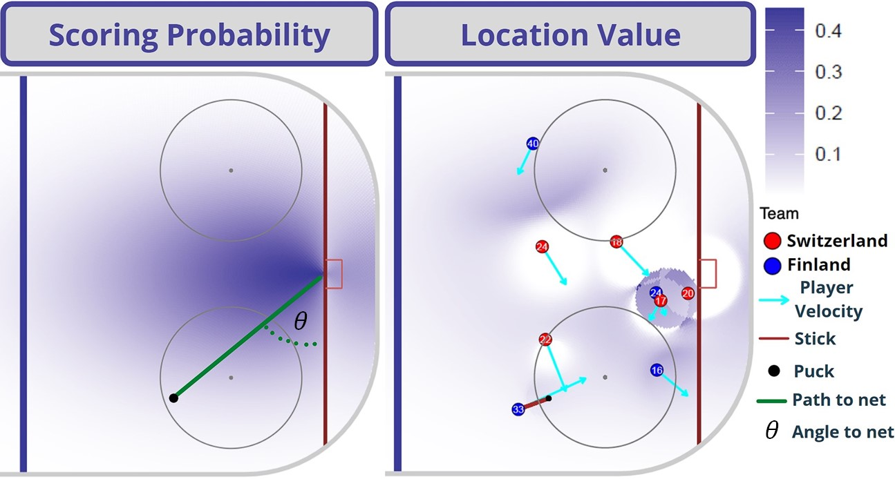
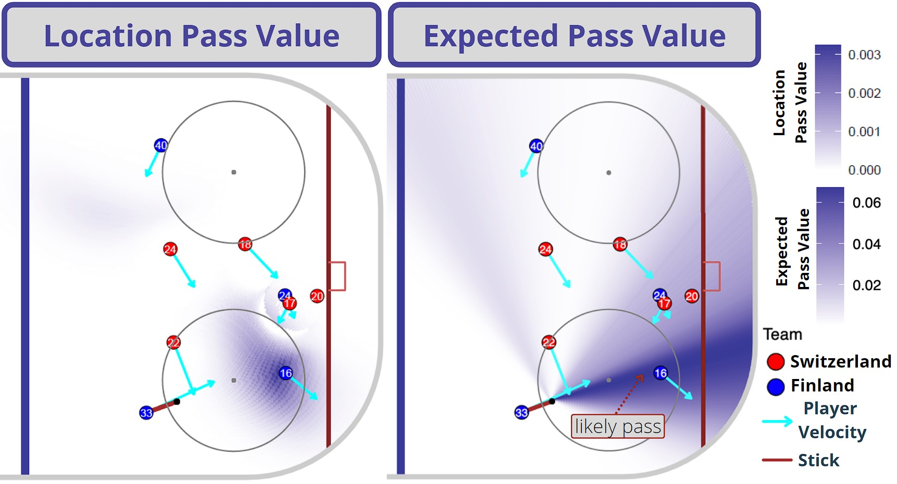
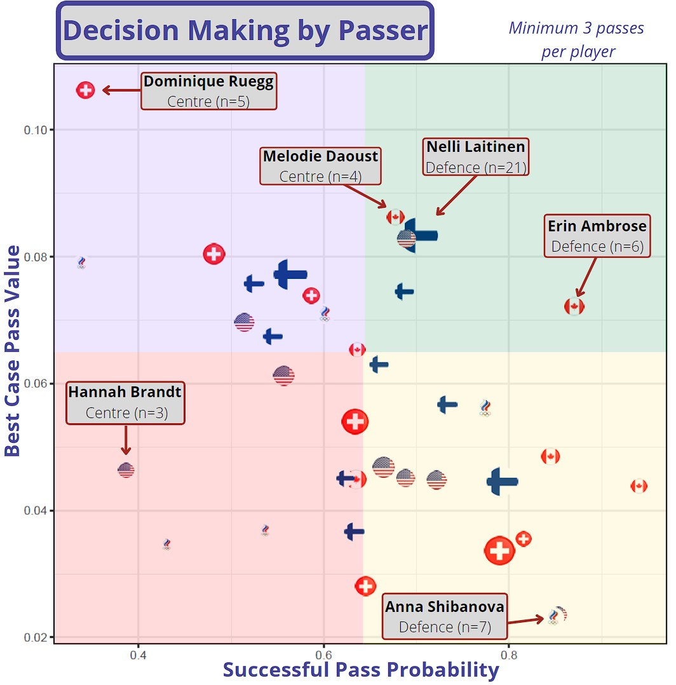
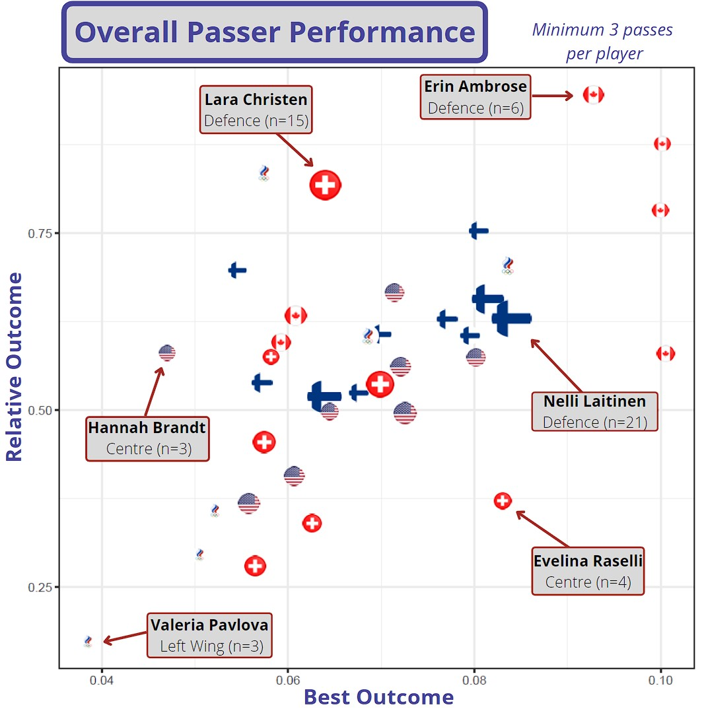

# Pass Analysis in  Olympic Women's Ice Hockey
Published by Alon Harell([@picagrad](https://github.com/picagrad)), Robyn Ritchie ([@ritchi12](https://github.com/ritchi12)), and Phil Shreeves ([@pshreeves](https://github.com/pshreeves))   
Repository containing data and code for our submission to the 2022 Big-Data-Cup at the 2022 Ottawa Hockey Analytics Conference (#OTTHAC22).  
See our full submission on [arXiv](https://arxiv.org/pdf/OUR_PAPER_NUMBER.pdf).

## Pass Analysis
All examples and plots here are taken from the following play:  
  
We divide the ice into triplets of time an location based on our puck motion model:  
  
Next, we calculate rink control at all triplets:  
  

From here we begin using our probabilistic passing model to create some more specific metrics such as:  
  
  
  

Using these, we go over the entire dataset to produce our summary metrics:  
  
  

## Requirements
For reading the data we use a jupyter notebook on python. Some basic requirements (older version will likely work just as well):
- Python3 : 3.9.7
- Pandas: 1.4.2
- Numpy: 1.22.3
- IPython: 8.2.0
- ipykernel: 6.12.1

The R code is self contained and will install all necessary packages if run in RStudio version 4.2.0

## Usage
### Main files
[Data_Clean.ipynb](./code/data_manipulation/Data_Clean.ipynb) contains all of the data reading and filtering, as well as calculations of speed and angle, and saves a JSON file to be opened by the R code.  
[BDC_2022_inR.Rmd](./code/BDC_2022_inR.Rmd) allows loading, analyzing, and producing the majority of plots for any one specific play.  
[BDC_PassModel.Rmd](./code/BDC_PassModel.Rmd) contains the code analyzing each play at multiple passing speeds, for the entire dataset.  

### Auxiliary Code
[hockey_pipeline.R](./code/hockey_pipeline.R) contains the majority of our models and auxilliary functions.  
[interactive_plot.R](./code/visualization/interactive_plot.R) contains auxilliary code for plotting our summary statistics.

